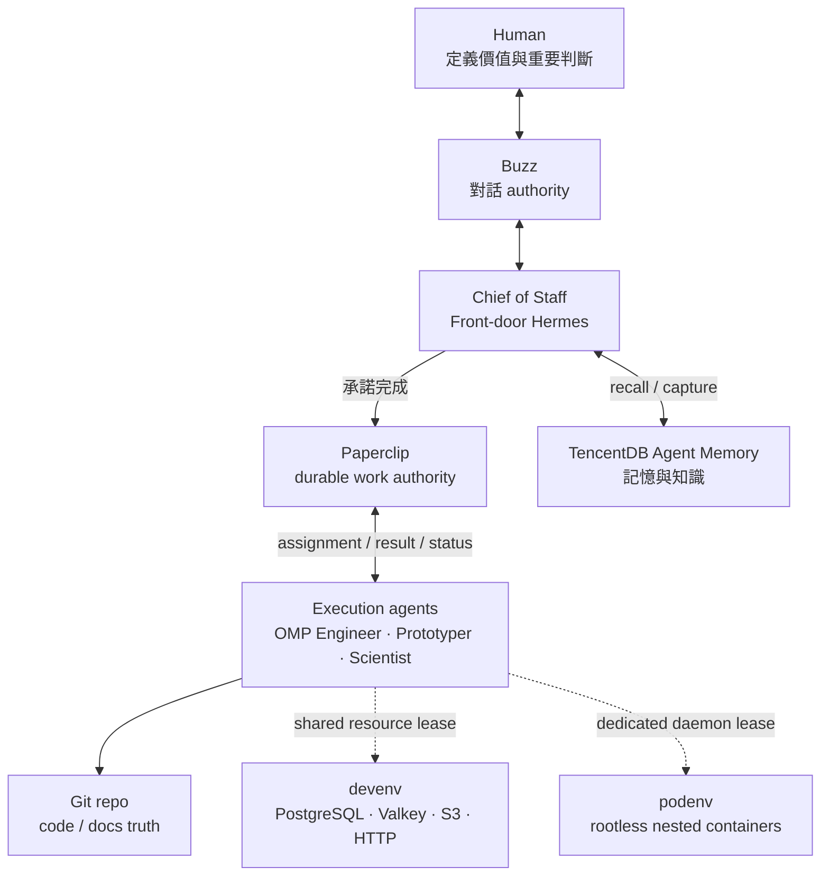

# OPC Stack

OPC Stack 是為單一操作者設計的 Docker Compose agent company runtime，整合對話入口、工作控制面、執行 agents、開發資源與長期記憶。你大部分時間只需要和 **Chief of Staff** 對話；它會保留上下文、判斷需求該去哪裡，並協調其他 agents。

核心規則是「一個概念只有一個 durable writer authority」：Buzz 擁有對話、Paperclip 擁有可追蹤工作、TencentDB 保存供 reasoning 使用的記憶與知識，而程式碼與文件的事實來源是 Git repo。

## 心智模型

日常流程不是由人逐一管理 agents，而是：

1. Human 透過 Buzz（或 Hermes dashboard）和 **Chief of Staff** 對話。
2. Chief of Staff 判斷內容應該消失、存成記憶，或成為必須完成的工作；它負責分流，不自己實作。
3. 必須完成的工作會成為 Paperclip issue，再依性質指派給 engineering、prototype 或 research lane。
4. 執行 agent 將結果與狀態寫回 Paperclip；需要保留的程式碼與文件進 Git。記憶只提供 reasoning context，不會取代人的授權或 Paperclip 的工作狀態。

### Agents

| Agent | Runtime | 職責 |
|---|---|---|
| **Chief of Staff** | Front-door Hermes | 主要對話窗口；掌握上下文、判斷意圖、建立與分派工作，但不自己實作 |
| **OMP Engineer** | OMP | Coding agent；處理要長期保留的功能、bug fix、既有 issue 與 PR |
| **Prototyper** | OMP | Coding agent；快速建立可互動、附固定 preview URL 的產品原型 |
| **Scientist** | Hermes expert profile | Research agent；自己寫實驗、蒐集證據並回報判斷，不直接交付 production code |

兩個 coding agents 是 **OMP Engineer** 與 **Prototyper**；**Scientist** 則是跑在 Hermes gateway 裡、具獨立身分與常駐 devenv 租約的研究員。

## 架構



## 服務

| 服務 | 說明 | port |
|---|---|---|
| `buzz` | Nostr relay(+ pg/redis/minio) | 3000 |
| `frontdoor` | buzz-acp → `hermes acp`(與 buzz 共用 netns) | — |
| `hermes` | gateway API server (dashboard 關閉) | 8642 |
| `hermes-dashboard` | web dashboard over the buzz front door's hermes home (sessions + live logs/thinking) | 9119 |
| `paperclip` | canonical work control plane | 3100 |
| `devenv-pg` / `devenv-valkey` / `devenv-s3` | agent 共用、租戶隔離的 PostgreSQL/pgvector、Valkey 與 S3 | 5433 / 6380 / 9002（僅 localhost） |
| `podenv` | rootless Podman daemon，提供巢狀容器租約 | 23000–23015（僅 localhost） |
| `tencentdb-core` / `-hub` / `-proxy` | memory gateway / panel+knowledge / LLM proxy | 8420 / 8125+8424 / 8096 |

LLM 全棧預設使用 OpenCode Go(`https://opencode.ai/zen/go/v1`),`.env` 填 `OPENAI_API_KEY` 一個 key 即可。`OPENAI_BASE_URL` 控制 OpenAI-compatible endpoint;shared gateway/dashboard/Paperclip/TencentDB 的模型用 `OPENAI_MODEL`（預設 `deepseek-v4-flash`）,frontdoor relay 則用 `BUZZ_AGENT_MODEL`（預設 `deepseek-v4-pro`）。Hermes custom provider runtime 讀 key/base URL,模型以 `config.yaml` 為 source of truth。Hermes 的記憶走官方 `memory_tencentdb` provider,直連 `tencentdb-core`。

## 開發資源租約

### devenv

`devenv` 提供 agent 可直接使用、但彼此隔離的開發資源。預設租約會建立獨立的 PostgreSQL/pgvector database 與 Valkey ACL user；也可用 `--with` 選擇 `postgres`、`valkey`、`http`、`s3`，並將對應的連線變數寫入 workspace 的 `.env`。適合一般應用程式開發；agent 不需要也拿不到 host Docker。

```bash
docker compose exec -u node paperclip devenv provision demo --env-file /tmp/demo.env
docker compose exec paperclip devenv list          # 查看租約與用量
docker compose exec paperclip devenv release demo  # 手動刪除租約及資料
```

PostgreSQL 與 Valkey 也分別發佈在 host 的 `127.0.0.1:5433`、`127.0.0.1:6380`，可用租約輸出的憑證從 SQL/Valkey client 直接連線。租約不會自動回收。

### podenv

`podenv` 用 rootless Podman 在隔離的 service container 內提供 daemon 租約，適用於無法共享多租戶的服務，或只能以 image 取得的指定舊版本，例如 MySQL 5.7。PostgreSQL、pgvector、Valkey、Redis 家族預設會被導向 `devenv`；確實需要獨立或舊版 instance 時，必須用 `--dedicated` 記錄原因。

```bash
docker compose exec paperclip podenv provision legacy-erp --image mysql:5.7 --port 3306 \
  --as MYSQL_URL --env-file /tmp/legacy-erp.env
docker compose exec paperclip podenv list
docker compose exec paperclip podenv release legacy-erp  # 唯一回收路徑，連資料一起刪除
```

每個租約會取得 host port 與連線變數；資料會跨 stack restart 保留，但沒有自動 GC 或個別磁碟配額。完整選型、參數與限制見 `SETUP.md`，隔離與操作不變量見 `AGENTS.md`。

## 快速開始

```bash
scripts/setup.sh              # 新機器一鍵: .env → submodule init → prepare → build → up
scripts/prepare.sh            # patches/ → upstream/ 同步(改 patch 後、build 前必跑)
docker compose up -d --build  # 啟動/重建
tests/connectivity.sh          # 連通性測試(不碰 LLM)
docker compose logs -f <svc>  # 看日誌
```

改動一律改 `patches/<proj>/`,不直接改 `upstream/`(git submodule,乾淨 checkout)。

## 文件

- `AGENTS.md` — 架構、不變量、已知坑(改動前必讀)
- `SETUP.md` — 安裝、設定頁、agent wiring
- `docs/superpowers/` — 設計與實作計畫
